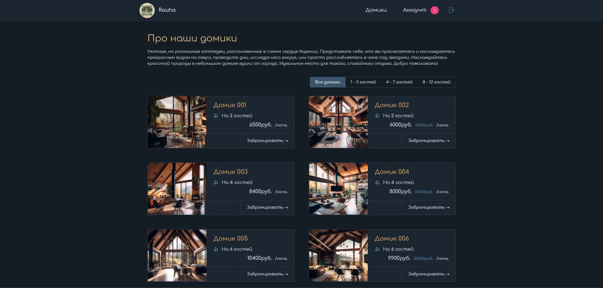

<div align="center">
 <div style="width: 90px; height: 90px; border-radius: 50%; overflow: hidden; margin: 0 auto;">
    
  </div>

  <h1>
    <a href="https://rauha-web.vercel.app/">
      Rauha - Booking
    </a>
  </h1>

  <hr>
</div>

<!-- Badges -->
<div align="center">


</div>

<!-- Brief -->
<p align="center">
Welcome to <b>The Rauha</b>! This is the customer version of the <a href="https://rauha-admin.netlify.app/">hotel management</a> web app, where users can view and book cabins based on availability, manage their bookings, and update their profiles.
</p>

<!-- Screenshot -->
<a align="center" href="https://rauha-web.vercel.app/">



</a>

## Live Site

Check out the live app here: [The Wild Oasis - Booking](https://rauha-web.vercel.app/)

## Admin Version

I also built an **admin version** of this app for hotel employees to manage cabins, bookings, and guests. The repository is [here](https://rauha-admin.netlify.app/).

## Features

- View all available cabins with descriptions and images.
- Book a cabin based on available dates and select the number of guests.
- Sign in with Google to manage bookings.
- View your booked cabins, edit them, or cancel if needed.
- Update your profile information.
- Fully responsive on all devices (I made sure to make it mobile-friendly!).

## Technologies Used

- **Next.js** (App Router)
- **Tailwind CSS** for styling
- **Supabase** for the database (shared with the admin app)
- **NextAuth.js** for authentication (Google sign-in)
- **Date-fns** for date handling

## Setup Instructions

To run this project locally:

1. Clone the repo:
   ```bash
   git clone https://github.com/stpkkk/rauha-web.git
   ```
2. Install dependencies:
   ```bash
   npm install
   ```
3. Set up environment variables:
   - You’ll need to configure Supabase and NextAuth (Google sign-in). Add your environment variables in a `.env.local` file. Check out the `.env.local.example` for what you need to include.
4. Run the development server:
   ```bash
   npm run dev
   ```
5. Open [http://localhost:5173](http://localhost:5173) to see the app.
